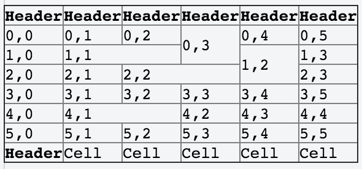
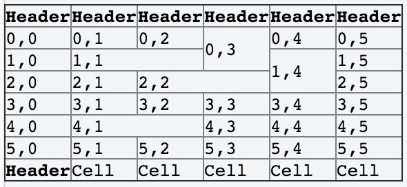

## 获取含有 rowspan/colspan 的表格中 td 元素的 row/col 下标

当表格含有 rowspan/colspan 时直接使用 jQuery 的 `index()` 方法去获取下标是错误的。



http://jsfiddle.net/wenyi/TRr6C/71/

那么应该如何处理比较好呢，可以使用一个二维数组记录 rowspan 和 colspan，从而得到正确的值。

```js
var m = [];
$('tbody tr').each(function (y) {
    $(this).find('td').each(function (x) {
        var $this = $(this),
            cspan = +$this.attr('colspan') || 1,
            rspan = +$this.attr('rowspan') || 1,
            tx, ty;

        for (; m[y] && m[y][x]; x++); //skip already occupied cells in current row

        for (tx = x; tx < x + cspan; tx++) { //mark matrix elements occupied by current cell with true
            for (ty = y; ty < y + rspan; ty++) {
                if (!m[ty]) { //fill missing rows
                    m[ty] = [];
                }
                m[ty][tx] = true;
            }
        }
        $this.html([y, x].join(','));
    });
});
```


http://jsfiddle.net/wenyi/TRr6C/73/